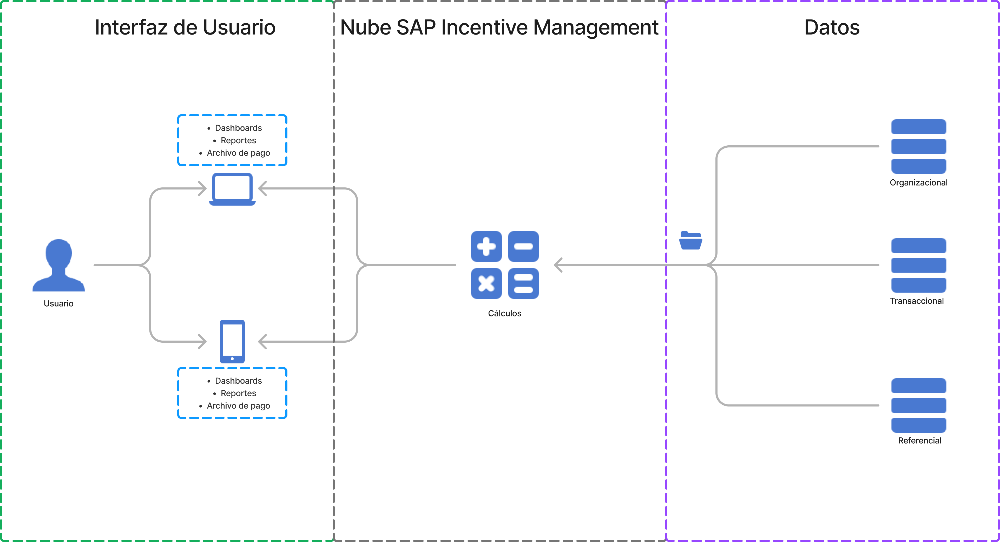
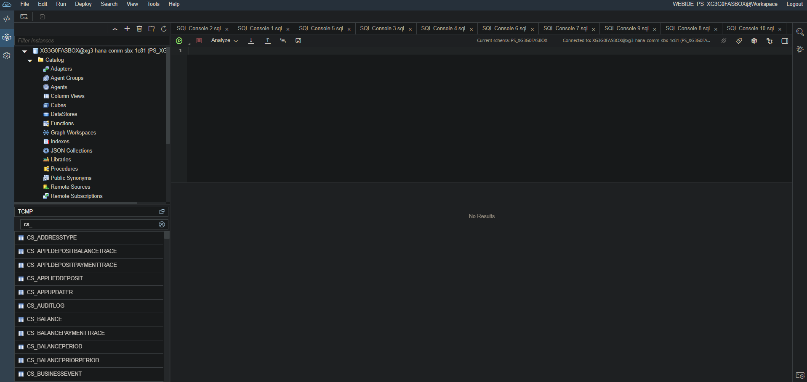
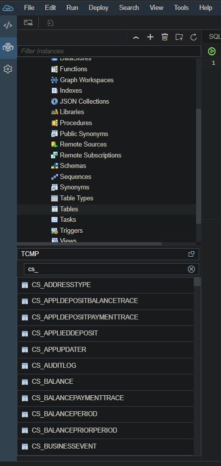
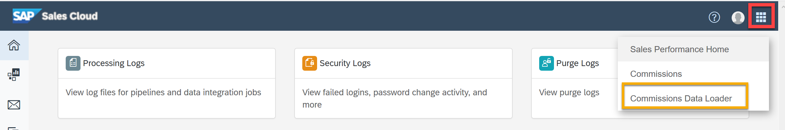
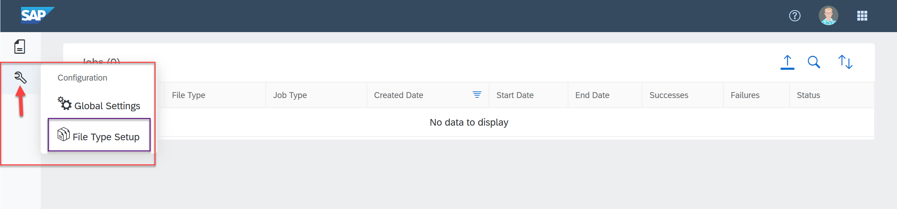
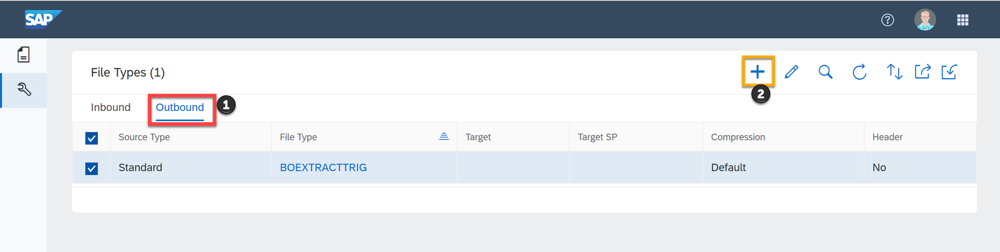
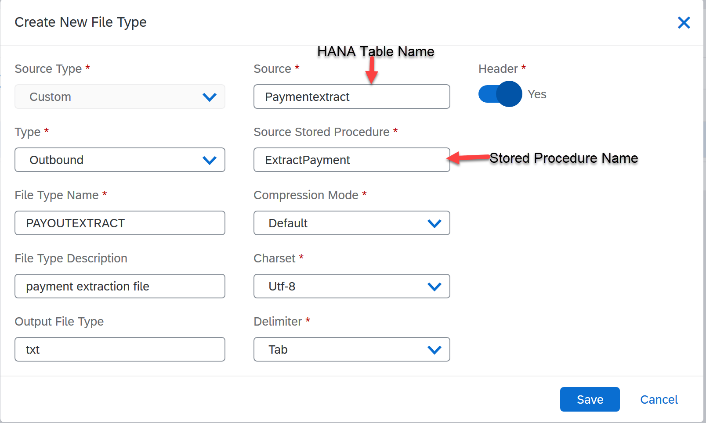
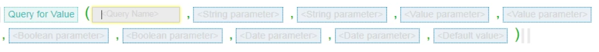
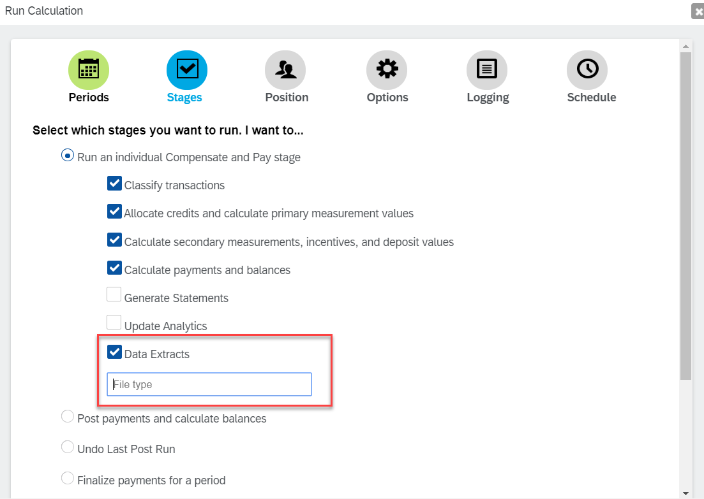

### 1 Introducción
SAP Incentive Management es una solución de software que forma parte del portafolio de SAP para la gestión de incentivos y comisiones. Esta herramienta está diseñada para ayudar a las empresas a automatizar, calcular y gestionar los programas de compensación basados en incentivos para sus empleados, especialmente aquellos en ventas y otras funciones basadas en el rendimiento.

+ Características
    - Automatización de cálculos: Facilita la automatización de cálculos complejos de incentivos, comisiones y bonificaciones basados en diversas reglas y métricas de rendimiento.
    - Transparencia: Proporciona transparencia en cómo se calculan y distribuyen los incentivos, lo que puede mejorar la satisfacción y motivación de los empleados.
    - Integración: Se integra con otros sistemas SAP y sistemas externos para obtener datos de ventas, CRM, y otros puntos de datos necesarios para los cálculos de incentivos.
    - Gestión de Planes: Permite a las empresas diseñar, administrar y ajustar planes de incentivos de acuerdo con las estrategias de negocio y los objetivos de ventas.
    - Análisis y Reportes: Ofrece herramientas de anális is y reportes para monitorear el rendimiento y el impacto de los programas de incentivos.
    - Cumplimiento y Auditoría: Ayuda a asegurar el cumplimiento de políticas internas y regulaciones externas, facilitando la auditoría de cómo se asignan y pagan los incentivos.
### 2 Flujo de Información

### 3 Tipo de información
+ Estructura de Datos

    - Metadatos Organizacionales: Contiene información detallada sobre los participantes del sistema, incluyendo sus roles, responsabilidades y jerarquías.
    - Catálogos de Referencia: Almacena conjuntos de datos estructurados que sirven como base para la clasificación y agrupación de información, como productos, servicios y clientes. Estos catálogos incluyen:
        - Taxonomías: Jerarquías de categorías y subcategorías para organizar la información de manera lógica.
        - Tablas de Referencia: Conjuntos de valores predefinidos que se utilizan para mapear datos y realizar cálculos.
    - Registro de Transacciones: Contiene un historial detallado de todas las operaciones realizadas dentro del sistema, incluyendo sus atributos y timestamps.

+ Lógica de Negocio

    - Motor de Reglas: El sistema implementa un motor de reglas para definir y ejecutar las políticas de cálculo de incentivos y comisiones. Las reglas se basan en la lógica de negocio y se expresan mediante un lenguaje de reglas específico.
    - Cálculo de Créditos: Las reglas de crédito se aplican a las transacciones para determinar la cantidad de crédito asignado a cada participante, basado en criterios predefinidos como el tipo de transacción, el monto o el producto involucrado.
    - Agrupación y Métricas: Los créditos calculados se agrupan según las reglas métricas definidas, permitiendo el análisis de los resultados a diferentes niveles de detalle.
    - Cálculo de Incentivos: Las reglas de incentivo se aplican a las métricas calculadas para determinar el valor de los incentivos a otorgar a los participantes. Se pueden definir múltiples salidas para un mismo incentivo, lo que permite personalizar las recompensas.
    - Comisiones: Las reglas de comisión son un tipo específico de reglas de incentivo que se aplican a nivel de detalle, considerando factores como el producto vendido o el cliente atendido.
    - Determinación de Pagos: Las reglas de depósito se utilizan para evaluar si los incentivos calculados son elegibles para pago, considerando criterios como umbrales mínimos, períodos de acumulación y restricciones presupuestarias.
### 4 Preparación del Sistema
+ SAP Incentive Management:

    - Canal de solicitud: Se deberá realizar una solicitud formal al cliente correspondiente.
    - Información a solicitar:
        - URL de acceso a la plataforma.
        - Credenciales de usuario compartidas (nombre de usuario y contraseña).

+ WebIDE:

    - Canal de solicitud: Se deberá abrir un ticket de soporte a través del canal establecido para ello.
    - Información a solicitar:
        - URL de acceso al WebIDE.
        - Credenciales de usuario para el acceso al WebIDE.
        - Credenciales de acceso a la base de datos (nombre de usuario, contraseña y cadena de conexión).

+ SFTP:

    - Generación de claves:
    Utilizando una herramienta especializada como PuTTYgen, se generará un par de claves SSH (pública y privada).
    Se recomienda guardar de forma segura la clave privada, ya que es esencial para el acceso al servidor SFTP.
    - Envio de la clave pública:
    La clave pública generada se enviará al equipo de soporte de SAP a través del canal de comunicación establecido.
    - Configuración del servidor:
    El equipo de soporte de SAP cargará la clave pública al directorio de autorización del servidor SFTP.
    - Credenciales de acceso:


### 5 Tablas Básicas
| Tabla          | Descripción     |
|----------------|-----------------|
| Cs_salesorder  |                |
| Cs_salestransaction |                |
| Cs_transactionassignment |                |
| Cs_gasalestransaction |                |
| Cs_gasalesorder |                |
| Cs_eventtype   |                |

| Tabla          | Descripción     |
|----------------|-----------------|
| Cs_position    |                |
| Cs_participant |                |
| Cs_payee       |                |
| Cs_title       |                |
| Cs_gaparticipant |                |
| Cs_gaposition  |                |
| Cs_positionrelation |                |

| Tabla          | Descripción     |
|----------------|-----------------|
| Cs_period     |                |
| Cs_calendar   |                |
| Cs_pipelinerun |                |
| Cs_earningcode |                |
| Cs_earninggroup |                |
| Cs_processingunit |                |
| Cs_businessunit |                |
| Cs_pluginquery |                |

| Tabla          | Descripción     |
|----------------|-----------------|
| Cs_credit       |                |
| Cs_creditselftrace |                |
| Cs_pmcredittrace |                |
| Cs_measurement |                |
| Cs_pmselftrace  |                |
| Cs_pmcredittrace |                |
| Cs_incentive    |                |
| Cs_incentivepmtrace |                |
| Cs_deposit      |                |
| Cs_depositpmtrace |                |
| Cs_depositincentivetrace |                |
| Cs_depositappldeposittrace |                |
| Cs_applieddeposit |                |
| Cs_appldepositpaymenttrace |                |
| Cs_payment      |                | 
### 6 Bases de Datos
#### TABLAS
+ Definición 

Una tabla en SQL es una estructura de datos organizada en filas y columnas que se utiliza para almacenar y organizar datos en una base de datos relacional. 

    + Características: 

        - Columnas: Representan los diferentes atributos o características de los datos que se están almacenando. Cada columna tiene un nombre y un tipo de dato específico (como INT para números enteros, VARCHAR para cadenas de texto, DATE para fechas, etc.).
        - Filas: Cada fila (también conocida como registro o tuple) representa una instancia de los datos, donde cada valor en la fila corresponde a una columna específica.
        - Clave Primaria (Primary Key): Generalmente, una tabla tiene una o más columnas designadas como clave primaria, que garantiza que cada registro sea único y facilita la identificación de registros.
        - Restricciones: Además de las claves primarias, las tablas pueden tener otras restricciones como claves foráneas (Foreign Keys), índices, chequeos (CHECK constraints) para mantener la integridad de los datos.

+ Entorno webIDE



+ Catálogo de Objetos


+ Creación de tablas
### Create tables
```sql
CREATE TABLE schema_name.table_name(
    column DATATYPE,
    columns DATATYPE,
    column DATATYPE,

    PRIMARY KEY (column, column)
)
```
+ Propiedades de los campos

Las columnas de una tabla pueden tener varios tipos de datos, los cuales se seleccionan de acuerdo a la naturaleza de la información que se desea almacenar. Aquí hay una lista de algunos de los tipos de datos más comunes:

    - Tipos de Datos Numéricos:
    INT o INTEGER: Para números enteros. Puede tener variantes como SMALLINT (menor rango) o BIGINT (mayor rango).
    FLOAT: Para números de punto flotante, con precisión variable.
    REAL: Similar a FLOAT, pero con una precisión definida.
    DECIMAL o NUMERIC: Para números decimales con precisión y escala específicas, como DECIMAL(10, 2) para números con 10 dígitos totales, 2 de los cuales son decimales.

    - Tipos de Datos de Texto:
    CHAR(n): Cadena de caracteres de longitud fija 'n'. Si el dato tiene menos caracteres, se rellena con espacios hasta alcanzar 'n'.
    VARCHAR(n) o CHARACTER VARYING(n): Cadena de caracteres de longitud variable hasta 'n'. Solo almacena la cantidad de caracteres necesarios.


    - Tipos de Datos para Fechas y Horas:
    DATE: Para almacenar fechas sin información de tiempo.
    TIME: Para almacenar tiempos del día sin fecha.
    TIMESTAMP: Para almacenar tanto la fecha como el tiempo.
    DATETIME: Similar a TIMESTAMP en algunos sistemas de bases de datos.

    - Tipos de Datos Booleanos:
    BOOLEAN: Para valores verdadero/falso. Aunque no todos los sistemas de bases de datos SQL soportan este tipo directamente, algunos usan BIT o CHAR(1) para este propósito.

+ Inserción de Datos en las tablas
```SQL
INSERT INTO SCHEMA.TABLE_NAME VALUES(
	/*ID_SUCURSAL <INTEGER>*/,
	''/*ID_EMPLEADO <VARCHAR(40)>*/,
	''/*ID_CVE_EMPRESA <VARCHAR(6)>*/,
	/*ID_TIPO_MESA <INTEGER>*/,
	/*ID_MESA <INTEGER>*/,
	''/*ID_CARGO <VARCHAR(6)>*/,
	''/*DESCRIPCION <VARCHAR(127)>*/,
	''/*FECHA_CREACION <DATE>*/,
	''/*FECHA_MODIFICACION <DATE>*/,
	/*ESTATUS <BOOLEAN>*/,
	''/*USUARIO_CREACION <VARCHAR(255)>*/,
	''/*USUARIO_MODIFICACION <VARCHAR(255)>*/
)
```

+ Actualización de campos y datos
```SQL
UPDATE SCHEMA.TABLE_NAME
SET COLUMN = VALUE
WHERE COLUMN = '' -- COLUMN_NAME AND VALUE
AND COLUMN = -- COLUMN_NAME AND VALUE
```

```SQL
ALTER TABLE SCHEMA.TABLE_NAME
ALTER (COLUMN VARCHAR(127)) -- COLUMN_NAME AND DATATYPE
```

+ Eliminación de registros y tablas
```SQL
DELETE FROM SCHEMA.TABLE_NAME
WHERE COLUMN_NAME = VALUE 
```

```SQL
DROP TABLE SCHEMA.TABLE_NAME
```


#### FUNCIONES
+ Definición
Una función es un objeto de base de datos que encapsula una serie de comandos SQL para realizar una tarea específica y que puede ser invocada repetidamente. 

    - Características de las Funciones en SQL:

        Reutilización de código: Permiten escribir una lógica que puede ser usada en múltiples lugares sin tener que duplicar el código.

        Tipado: Devuelven un único valor o un conjunto de valores de un tipo de dato específico.

        Parámetros: Pueden aceptar parámetros de entrada, que pueden ser utilizados dentro del cuerpo de la función.

        Determinismo: Pueden ser deterministas (siempre devuelven el mismo resultado para los mismos parámetros de entrada) o no deterministas.

        Seguridad: Las funciones pueden ser ejecutadas con los permisos del invocador o del propietario de la función, dependiendo de cómo se definan.

+ Sentencias de creación
### Create Functions
```sql
CREATE FUNCTION SCHEMA.FUNCTION_NAME (params1 DATATYPE, params2 DATATYPE) -- parameters
RETURNS variable_name DATATYPE
LANGUAGE SQLSCRIPT
AS
BEGIN

    -- Variables
    DECLARE some_var DATE;

    -- Script
    SELECT...
END
```
+ Colocación de Parámetros
```SQL
CREATE FUNCTION SCHEMA.FUNCTION_NAME (params1 DATATYPE, params2 DATATYPE) -- parameters
```
+ Llamada de la función
```SQL
SELECT SCHEMA.FUNCTION_NAME (PARAM1, PARAM2) FROM DUMMY
```


#### STORED PROCEDURES
+ Definición 

Un Stored Procedure (Procedimiento Almacenado) es una serie de instrucciones SQL predefinidas y almacenadas en la base de datos que se pueden ejecutar como una sola unidad. Estos procedimientos permiten a los desarrolladores y administradores de bases de datos encapsular lógica compleja, tareas repetitivas, y operaciones de manejo de datos para ser reutilizadas fácilmente

    - Características de los Stored Procedures:

        Reutilización de código: Al igual que las funciones, los stored procedures permiten escribir lógica una vez y reutilizarla múltiples veces.

        Parámetros de entrada y salida: Pueden aceptar parámetros (de entrada y/o salida) para hacerlos más versátiles. Los parámetros de salida permiten devolver múltiples valores.

        Transacciones: Pueden contener lógica de manejo de transacciones, lo que facilita la gestión de operaciones complejas que requieren atomicidad.

        Seguridad: Los permisos para ejecutar un stored procedure pueden ser administrados de manera independiente, permitiendo acceso controlado a ciertas operaciones sin necesidad de otorgar permisos sobre las tablas subyacentes.

        Performance: En muchos casos, los stored procedures pueden mejorar el rendimiento, ya que el plan de ejecución puede ser optimizado y almacenado en caché por el motor de la base de datos.

        Encapsulamiento: Ayudan a encapsular la lógica de negocio dentro de la base de datos, manteniendo la lógica centralizada y posiblemente reduciendo la complejidad en aplicaciones cliente.

+ Sentencia de creación
### Create Stored Procedures
```sql
CREATE PROCEDURE SCHEMA.PROCEDURE_NAME (params1 DATAYTPE, params2 DATATYPE)
LANGUAGE SQLSCRIPT
SQL SECURITY INVOKER
DEFAULT SCHEMA EXT
AS
BEGIN
    
    -- Variables
    DECLARE some_var DATE;

    -- Script
    SELECT...

END
```
+ Colocación de parámetros
```SQL
CREATE PROCEDURE SCHEMA.PROCEDURE_NAME (params1 DATAYTPE, params2 DATATYPE) -- PARAMETERS
```

+ Diferencias con funciones
Tanto los stored procedures como las funciones en SQL son formas de encapsular código para su reutilización, pero tienen varias diferencias clave:

    1. Propósito y Uso:
        - Stored Procedure: 
        Diseñado para realizar tareas que pueden no devolver necesariamente un valor. Se usa para operaciones que pueden incluir múltiples acciones como inserciones, actualizaciones, eliminaciones, o incluso operaciones complejas que involucren varias tablas y transacciones.
        Puede devolver múltiples valores a través de parámetros de salida o conjuntos de resultados.
        - Función: 
        Se utiliza principalmente para calcular y devolver un único valor o un conjunto de filas (en el caso de funciones de tabla). 
        Son más orientadas a operaciones de cálculo o transformación de datos que pueden ser usadas dentro de sentencias SQL como parte de una expresión.

    2. Retorno de Valores:
        - Stored Procedure: 
        Puede usar parámetros de salida (OUTPUT parameters) para devolver múltiples valores. También puede devolver múltiples conjuntos de resultados. No tiene que devolver un valor explícitamente; puede ejecutar acciones sin un retorno directo.
        - Función: 
        Debe devolver un valor o un conjunto de filas (en caso de funciones de tabla).
        Solo puede devolver un único valor escalar o un conjunto de filas.

Un SP puede contener funciones, pero una función no pueden contener un SP.


+ Llamada de un Stored Procedure
```SQL
CALL SCHEMA.PROCEDURE_NAME() -- PARAMS IF EXISTS
```
#### TRIGGER
+ Definición
Es un tipo de procedimiento almacenado que se activa automáticamente cuando se produce un evento específico en la base de datos. Su propósito principal es mantener la integridad de los datos, auditar cambios, o implementar reglas de negocio complejas sin necesidad de que el usuario o la aplicación intervenga directamente.

+ Sentencias de creación
### Create Trigger
```sql
CREATE TRIGGER "EXT"."TG_SUCME_AI" 
AFTER INSERT ON "EXT"."TB_EMPLEADO_TEST" 
REFERENCING NEW ROW MYNEWROW 
FOR EACH ROW 
BEGIN      

	-- Variables
	DECLARE id_tipo_mesa INT;
	DECLARE id_mesa INT;
	
	-- Script
END
```

#### VIEWS
+ Definición
Es una representación virtual de los datos que se obtienen de una o más tablas de una base de datos. Básicamente, es una consulta SQL almacenada como un objeto de la base de datos que se comporta como una tabla virtual.

+ Sentencias de creación
### Create Views
```sql
CREATE VIEW "EXT"."CSA_ASISTENCIA_ITX" ( "ID_SUCURSAL", "ID_EMPLEADO", "FECHA_ASISTENCIA", "ASISTENCIA_ITX" ) 
AS (SELECT ID_SUCURSAL, ID_EMPLEADO, FECHA_ASISTENCIA, ASISTENCIA_ITX
	FROM EXT.TB_ASISTENCIA_WKF
	WHERE FECHA_ASISTENCIA = '2024-07-24'
	AND ID_SUCURSAL = 661
) WITH  STRUCTURED PRIVILEGE CHECK
```
### 7 CDL
+ Definición

CDL (Comissions Data Loader) es un componente fundamental de Commissions que permite la transferencia segura y eficiente de datos estructurados. Facilita la integración de Commissions con otros sistemas, permitiendo la importación y exportación de datos de objetos de negocio específicos. CDL es ideal para sincronizar grandes volúmenes de información en un entorno empresarial.

+ Tipos de Esquema
    - TCMP: El esquema base constituye el repositorio central de todos los datos indispensables para el cálculo preciso de incentivos. Contiene información detallada sobre transacciones, reglas de negocio, jerarquías organizacionales, cuotas, tablas de referencia y demás elementos relevantes. Dada su naturaleza fundamental, este esquema se configura con permisos de solo lectura para los usuarios, asegurando así la integridad y consistencia de los cálculos."

    - EXT: Mientras que el esquema TCMP actúa como un repositorio de datos inmutable, este esquema se configura como un entorno de desarrollo dinámico. Los desarrolladores disponen de los permisos necesarios para crear, modificar y eliminar objetos de base de datos, adaptando la estructura a las necesidades evolutivas de los cálculos de incentivos.

+ Commissions Data Loader

CDL permite la importación y exportación de datos estructurados correspondientes a los objetos de negocio definidos en Commissions. La herramienta facilita la transferencia masiva de datos entre Commissions y sistemas externos, empleando formatos de archivo plano con codificación UTF-8 como estándar. 

Los datos se organizan en los siguientes espacios de trabajo: Orders and Transactions (Resultados), Participants, Positions, and Titles (Organización), y Categories, Products, Customers, and Postal Codes (Clasificación). 

Una operación de importación (Inbound) consiste en cargar datos desde un sistema externo hacia Commissions, mientras que una exportación (Outbound) implica extraer datos de Commissions hacia un sistema externo.

+ Archivos CDL

Para garantizar la estandarización y agilizar el proceso de carga de datos, se proporcionan plantillas en formato .xls comprimidas en un archivo .zip. Estas plantillas, diseñadas para cada objeto de negocio, ofrecen un esquema predefinido que simplifica la creación de archivos de carga y reduce el riesgo de errores.
[imagen CDL]

+ EXT como personalización

En ocasiones, la estructura predefinida de un CDL estándar puede resultar insuficiente para satisfacer los requisitos específicos de un proceso de importación o transferencia de datos. En estos casos, es posible definir CDLs personalizados que se ajusten a las necesidades particulares del usuario. Estas personalizaciones se implementan en el esquema EXT.

### 8 Archivos CDL
+ Express Data Loader (XDL)

XDL es una herramienta de carga y descarga de datos basada en la nube que ofrece una interfaz intuitiva para la integración de datos. Permite al equipo de compensaciones realizar operaciones de ETL (Extracción, Transformación y Carga) de manera eficiente, sin requerir conocimientos avanzados de programación. [img XDL]


+ File Type Setup

Abarca tanto los formatos de entrada como de salida de datos.

    - Inbound: La configuración incluye la definición de un esquema detallado, el cual especifica los metadatos y la estructura de cada registro. Es mandatorio asignar un File Type único a cada plantilla, estableciendo así una relación uno a uno. Los parámetros configurables comprenden el formato de archivo, las opciones de importación y la tabla de destino. Asimismo, es posible personalizar el conjunto de caracteres y el delimitador utilizados en la separación de los campos.

    - Outbound: La configuración define la estructura y los metadatos de los archivos generados, incluyendo aquellos que contienen datos de pago. Esta configuración abarca aspectos como el formato de salida, el procedimiento almacenado que suministra los datos y las opciones de compresión. Al igual que en la configuración de entrada, se permite personalizar el conjunto de caracteres y el delimitador utilizados para separar los campos.



+ Configuración del File Type Setup 
1. Inicio de Sesión
2. Click en los cuadritos para abrir el XDL (Express Data Loader)
3. Click en el ícono de la herramienta para abrir el File Type Setup
4. Click en (+)

5. Colocar los parámetros requeridos

[View XDL pdf to ref]

+ Carga de CDL's desde SFTP
1. Establecer la conexión vía SFTP
2. Armar el CDL de acuerdo al File Type SetUp
3. Arrastar al archivo hacia INBOUND
4. Validar la carga desde XDL
5. Validar la carga en la BD

### 9 Query For Value
+ Definición

La integración de funciones de consulta en los procesos de canalización permite una mayor flexibilidad en la extracción y manipulación de datos. Estas funciones facilitan la ejecución de consultas SQL en tiempo real, cuyos resultados pueden ser utilizados por el equipo de servicios profesionales para crear soluciones personalizadas que complementen las capacidades estándar del producto.

```
Formula: Query for String (<query name>, <string parameter>, <string parameter>, <value parameter>, <value parameter>, <value parameter>, <boolean parameter>, <boolean parameter>, <date parameter>, <date parameter>, <default value>)
```

+ Variables como contexto

    - $pipelineRunSeq - current pipeline run's pipelineRunSeq
    - $periodSeq - current pipeline run's periodSeq
    - $positionSeq - current position in the processing

+ Variables como parámetros

    - $1 - value of the first String parameter in the Query function. (first String parameter)
    - $2 - value of the second String parameter in the Query function (second String parameter)
    - $3 - value of the first Value parameter in the Query function (first Value parameter)
    - $4 - value of the second Value parameter in the Query function (second Value parameter)
    - $5 - value of the first Boolean parameter in the Query function (first Boolean parameter)
    - $6 - value of the second Boolean parameter in the Query function (second Boolean parameter)
    - $7 - value of the first Date parameter in the Query function (first Date parameter)
    - $8 - value of the second Date parameter in the Query function (second Date parameter)

+ Formula o función General


+ Reestricciones Generales
    - Sólo se permite la función SELECT SQL, cualquier otro tipo de SQL como INSERT, UPDATE, DELETE fallará.
    - La consulta tiene que terminar antes de 5 segundos, o se cancelará. (La consulta finalizará y el pipeline continuará).
    - Si la consulta devuelve varias filas, sólo se devolverá el valor de la primera fila.

+ Tipos de Queries
    - Query for Value
    - Query for String
    - Query for Boolean
    - Query for Date

+ Creación y colocación de parámetros
```sql
INSERT INTO "TCMP"."CS_PLUGINQUERY" VALUES(
	''/*TENANTID <VARCHAR(4)>*/,
	''/*NAME <VARCHAR(255)>*/,
	''/*QUERY <CLOB>*/,
	''/*DESCRIPTION <VARCHAR(4000)>*/
)
```

+ Llamada desde webiDE
1. Colocar el query con los parámetros 

### 10 Data Extract
+ Definición

La funcionalidad de extracción de datos, accesible desde la opción 'Run > Pipeline', permite exportar diversos tipos de archivos durante la ejecución de una cálculo. Esta característica, disponible en entornos que emplean Express Data Loader y bases de datos HANA, facilita la extracción de datos estructurados de acuerdo a las especificaciones predefinidas por el usuario. Los archivos resultantes son almacenados en la ruta de salida configurada previamente (outbound).



+ Declaración del File Type

+ Declaración y creación de tablas y script

+ Proceso de extracción

+ Verifiación de Salida SFTP
El archivo de extracción se debe depositar en la carpeta OUTBOUND del SFTP

### 11 Stagehook
Es un proceso personalizado con una configuración no estándar diseñada para ejecutar funcionalidades que exceden las capacidades predeterminadas de la herramienta.

- Pre-stage, Post-stage, Stage failure: Procedimiento previo a una etapa, posterior a una etapa y en caso de falla de una etapa, respectivamente.

- Archivo .xml: El archivo .xml requerido para el soporte técnico debe solicitarse previamente a través de un ticket.

### 12 Migraciones
Se establece que las migraciones de los ambientes DEV y TST hacia el ambiente PRD se llevarán a cabo mediante la generación de un ticket formal en la plataforma SAP For Me.

Previo a la ejecución de la migración, se solicitará al equipo de soporte técnico el archivo de CustomCodeMigration. Este documento deberá contener una descripción exhaustiva del código a migrar, así como los scripts correspondientes, los cuales serán almacenados en archivos de texto (.txt) con una nomenclatura que facilite su identificación. El archivo de CustomCodeMigration, una vez finalizado, será entregado al equipo de soporte para su procesamiento en el entorno productivo.


